# RepoTEC

Repositório de Projetos Técnicos

O RepoTEC é uma plataforma web desenvolvida para gerenciar e compartilhar projetos técnicos. O sistema permite que usuários cadastrem, visualizem e avaliem projetos, facilitando a organização e a disseminação do conhecimento técnico.

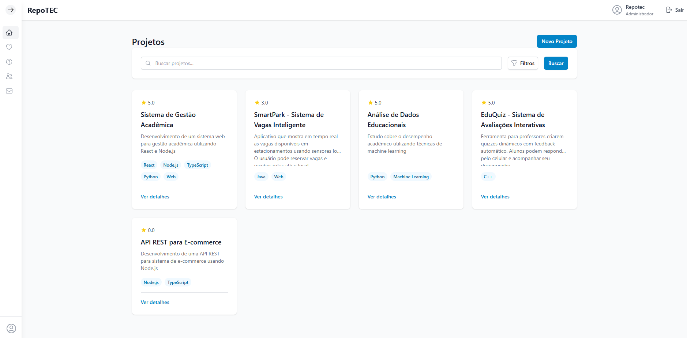
_Tela inicial do RepoTEC_

Principais funcionalidades:
- Cadastro e gerenciamento de projetos técnicos
  
  _Formulário de cadastro de projeto_
- Sistema de avaliação e feedback
  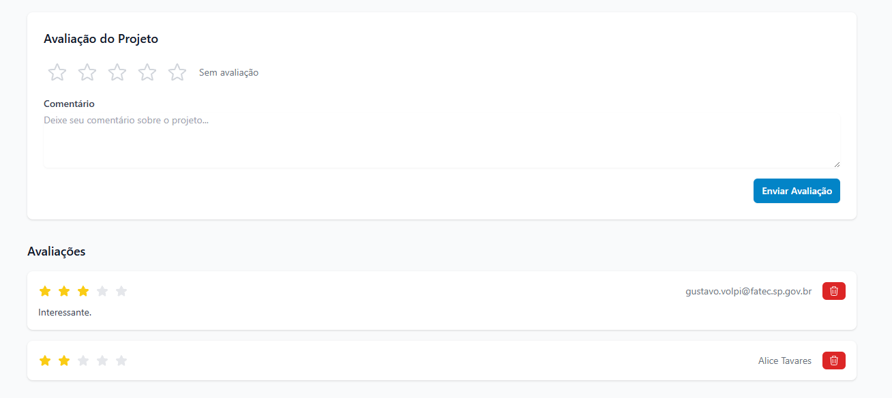
  _Tela de avaliação de projeto_
- Upload e download de arquivos
- Sistema de tags para categorização
  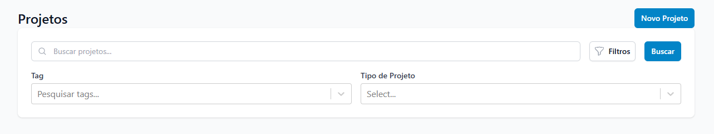
  _Opções de filtragem de projetos_
- Interface responsiva e intuitiva
  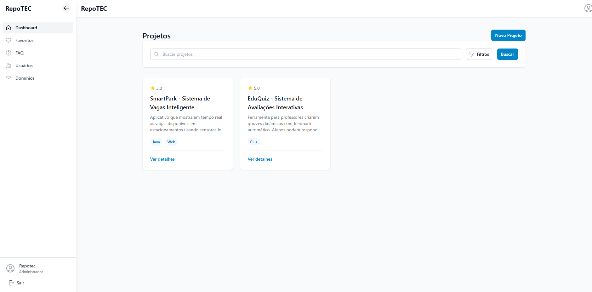
  _Barra lateral de administração_
- API RESTful para integração com outros sistemas


_Tela de login do sistema_

## Requisitos

- Node.js 20.x
- MySQL 8.0
- Docker e Docker Compose (opcional)

## Configuração do Ambiente

### 1. Sem Docker (Desenvolvimento Local)

#### Backend

1. Instale as dependências:
```bash
cd repotec-backend
npm install
```

2. Configure o arquivo `.env`:
```bash
cp .env.example .env
# Edite o arquivo .env com suas configurações
```

3. Execute as migrações:
```bash
npm run migration:run
```

4. Inicie o servidor de desenvolvimento:
```bash
npm start dev
```

#### Frontend

1. Instale as dependências:
```bash
cd repotec-app
npm install
```

2. Inicie o servidor de desenvolvimento:
```bash
npm run dev
```

### 2. Com Docker (Desenvolvimento)

1. Instale as dependências localmente (fora do Docker):
```bash
# Backend
cd repotec-backend
npm install

# Frontend
cd repotec-app
npm install
```

2. Inicie os containers:
```bash
docker-compose -f docker-compose.dev.yml up
```

Os serviços estarão disponíveis em:
- Backend: http://localhost:3000
- Frontend: http://localhost:5173
- MySQL: localhost:3306

### 3. Com Docker (Produção)

1. Construa e inicie os containers:
```bash
docker-compose up --build
```

Os serviços estarão disponíveis em:
- Backend: http://localhost:3000
- Frontend: http://localhost:3000 (servido pelo backend)
- MySQL: localhost:3306

## Documentação da API

A documentação da API está disponível em:
- Desenvolvimento: http://localhost:3000/api/api-docs
- Produção: http://localhost:3000/api/api-docs

## Estrutura do Projeto

- `repotec-backend/`: Backend em NestJS
- `repotec-app/`: Frontend em React + Vite

<h2>Scripts Disponíveis</h2>

<h3>Backend</h3>
- `npm run start:dev`: Inicia o servidor em modo desenvolvimento
- `npm run start:prod`: Inicia o servidor em modo produção
- `npm run migration:run`: Executa as migrações do banco de dados
- `npm run migration:show`: Mostra o status das migrações
- `npm run migration:revert`: Reverte a última migração

<h3>Frontend</h3>
- `npm run dev`: Inicia o servidor de desenvolvimento
- `npm run build`: Gera a build de produção
- `npm run preview`: Previa a build de produção localmente

## Variáveis de Ambiente

### Backend (.env)
```env
DATABASE_HOST=localhost
DATABASE_PORT=3306
DATABASE_USER=repotec
DATABASE_PASSWORD=repotec123
DATABASE_NAME=repotec
NODE_ENV=development
PORT=3000
```

### Frontend (.env)
```env
VITE_API_URL=http://localhost:3000
```

## Observações

- Em desenvolvimento, o frontend roda na porta 5173 para hot-reload
- Em produção, o frontend é servido pelo backend na porta 3000
- As migrações são executadas automaticamente no Docker
- Em desenvolvimento local, execute as migrações manualmente

## Mais Telas do RepoTEC

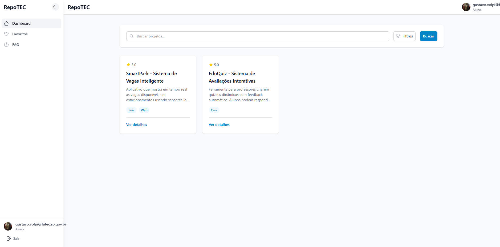
_Barra lateral para alunos_

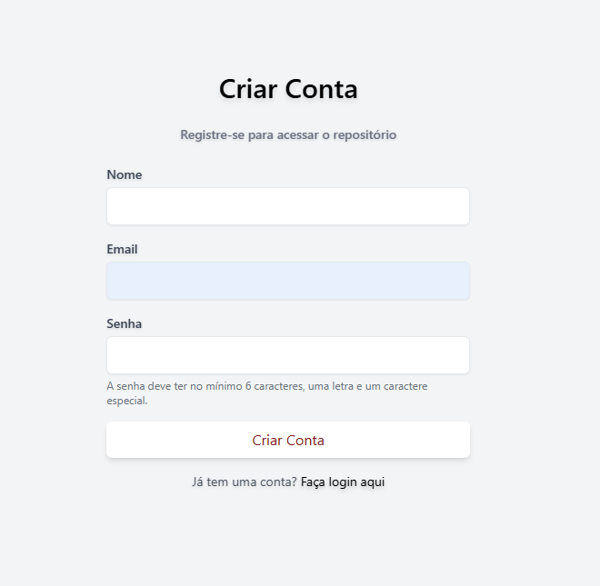
_Formulário de criação de conta_

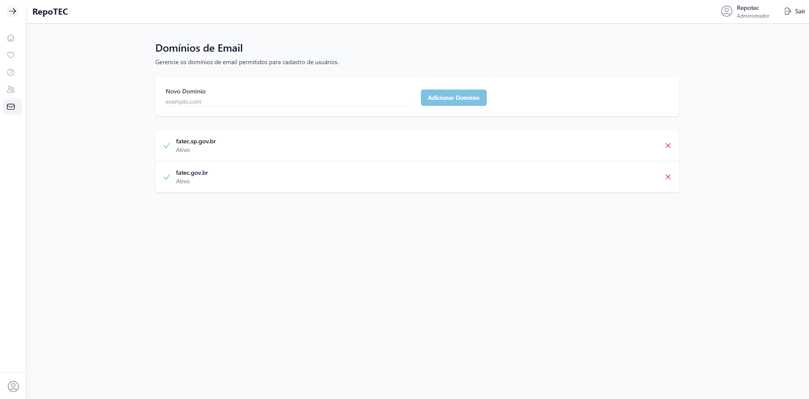
_Configuração de domínios de email_

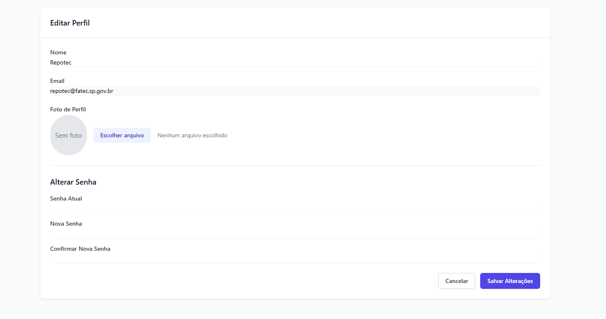
_Tela de edição de perfil de usuário_

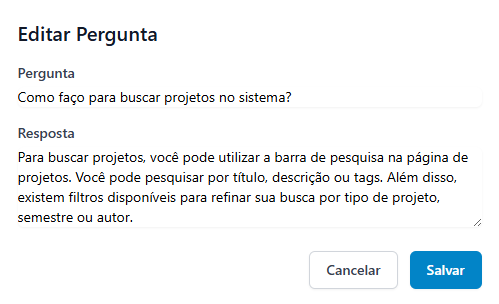
_Tela para editar uma pergunta frequente_

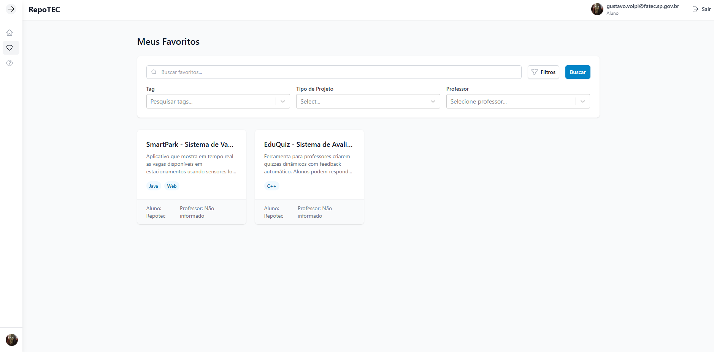
_Projetos favoritos do usuário_


_Opções de filtragem de projetos_

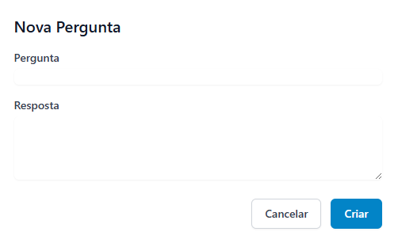
_Formulário para incluir uma nova pergunta frequente_

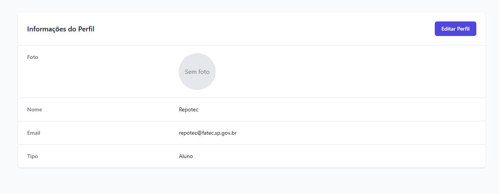
_Página de perfil do usuário_

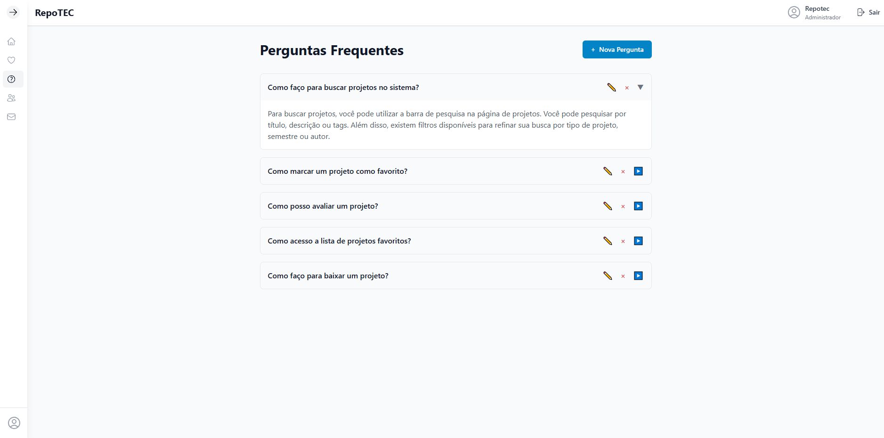
_Seção de perguntas frequentes_

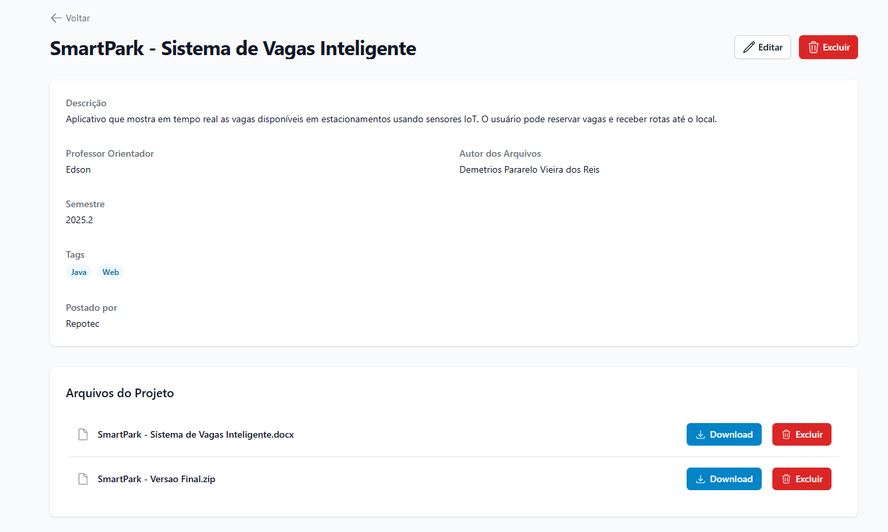
_Visualização detalhada de um projeto_

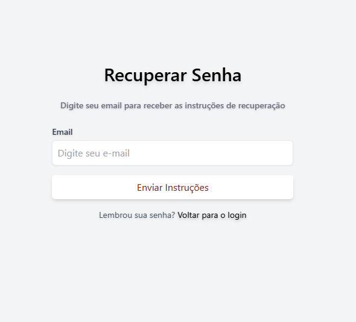
_Tela de recuperação de senha_

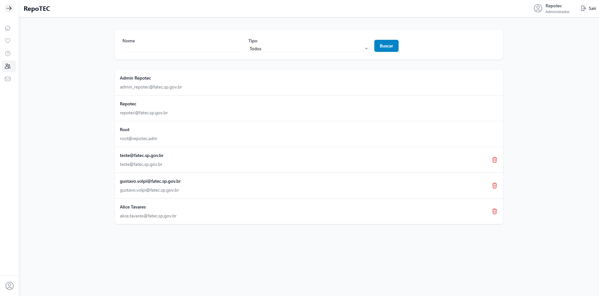
_Listagem de usuários_

---